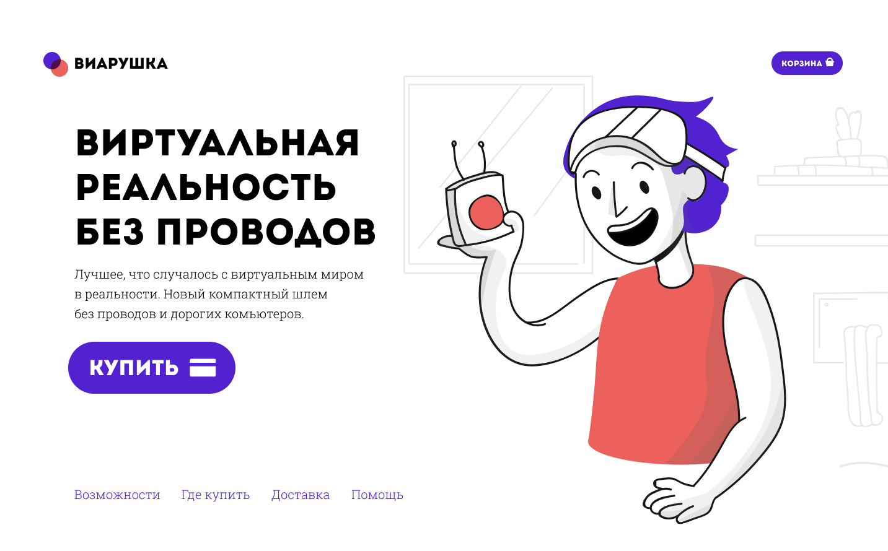

# BEM-methodology

Странички по методологии БЭМ.

Многостраничный сайт созданный на основе общедоступного
[макета в Figma](https://www.figma.com/design/MFHCz4306cpleF8eMus4bI/VR?node-id=1-27&node-type=frame&t=9oJ8tZNLFUdWxNid-0) 👈

## Технологии:

## Результат:

<a href="https://xeni-ya.github.io/BEM-methodology/">Перейти по ссылке 👆</a>
